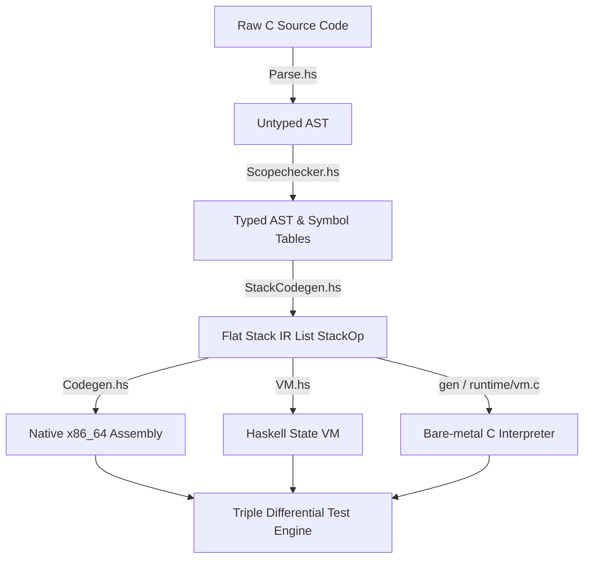
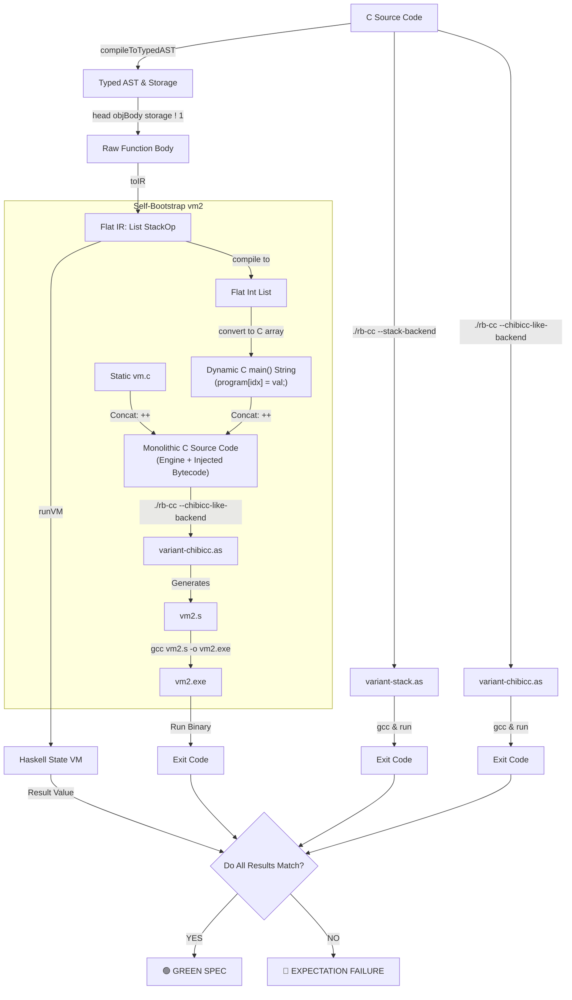

# rb-cc 🚀 (Compiler + IR + VM)

A toy C compiler written in Haskell, showcasing a 5-stage architecture with a flat stack-based Intermediate Representation (IR), a native x86_64 backend (AT&T syntax), and a dual-runtime execution verification engine.

---

## 🏛️ ARCHITECTURE PIPELINE

---

## 📅 INTERACTIVE ROADMAP

- [x] **SPRINT 1: Frontend Cleanup** — Isolated scopechecking pass, untyped AST sanitization.
- [x] **SPRINT 2: MVP IR & Backend Infrastructure** — State-based Haskell VM, bare C runtime (`vm.c`), AT&T x86_64 generation.
- [x] **SPRINT 3: Arithmetic & Comparisons** — Binary ops (`+`, `-`, `*`, `/`, `==`, `!=`, `<`, `<=`) and recursive unary minus (`-`).
- [ ] **SPRINT 4: Variables & Control Flow** — `LoadLocal`/`StoreLocal`, flattened `Jmp`/`JmpZero` jumps, runtime visual stack frames.
- [ ] **SPRINT 5: Complex Types & Macros** — Pointers (`*`, `&`), simulated flat RAM array for VMs, string preprocessor.
---

## 🔬 END-TO-END TRANSLATION LISTING

Here is how the compiler translates a simple arithmetic expression `return -22 + 20;` across the intermediate boundaries:

| 1. C Source Code | 2. Stack-based Flat IR (`[StackOp]`) | 3. Native x86_64 Assembly (AT&T) |
| :--- | :--- | :--- |
| <pre>int main() {   return -22 + 20; }</pre> | <pre>PushInt 22 NEG PushInt 20 ADD Ret</pre> | <pre>.global main main:     pushq %rbp     movq %rsp, %rbp     pushq $22     popq %rax     negq %rax     pushq %rax     pushq $20     popq %rcx     popq %rax     addq %rcx, %rax     pushq %rax     popq %rax     jmp .L.return.main</pre> |

---

## 🔬 TRIPLE DIFFERENTIAL TESTING

The core strength of `rb-cc` is its **Triple Differential Testing Engine** implemented inside `VMSpec.hs`. Instead of just verifying text output, every single test case compiles the C source code down to three radically different execution targets simultaneously. 

For any C expression, `rb-cc` cross-checks results across three independent runners:

1. 💻 **Native x86_64 Execution:** The compiler generates raw AT&T assembly, assembles it via `gcc`, executes the binary as a native Linux process, and catches the exit code.
2. 🚀 **Haskell State VM:** The Intermediate Representation (`[StackOp]`) is evaluated directly inside Haskell's `State` monad emulator (`VM.hs`), simulating stack mutations in a pure environment.
3. 🛠️ **Bare-Metal C VM:** The `[StackOp]` list is serialized into a raw bytecode stream (flat array of `int`) and fed into `vm.c` — a pure, zero-dependency C byte-code interpreter loop.

---

## 🗺️ ACKNOWLEDGEMENTS & INSPIRATION

`rb-cc` is heavily inspired by and follows the evolutionary step-by-step commitment approach of [chibicc]https://github.com/rui314/chibicc) by Rui Ueyama. 

While `chibicc` focuses on direct assembly generation for a registry-based machine, `rb-cc` adapts these concepts into a functional paradigm using Haskell, introducing a flat stack-based Intermediate Representation (IR) and an explicit multi-runtime verification layer (`vm.c` / `VM.hs`). Huge thanks to Rui for providing a legendary blueprint for modern toy compiler development.

